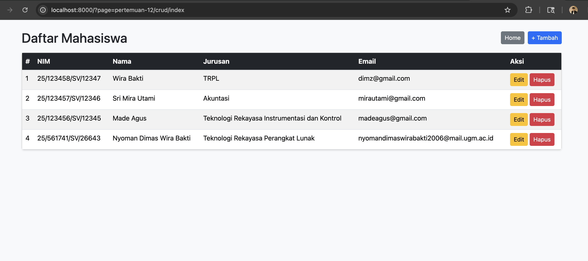

# Portofolio Praktikum Pemrograman Web 1

Kumpulan tugas Praktikum Pemrograman Web 1
Program Studi Teknologi Rekayasa Perangkat Lunak (TRPL) — Semester 2

---

## Tentang Saya

| Info  | Detail                  |
| ----- | ----------------------- |
| Nama  | Nyoman Dimas Wira Bakti |
| NIM   | 25/561741/SV/26643      |
| Prodi | TRPL                    |

## Demo Live

Project CRUD:

## Daftar Tugas

| Bab       | Topik                     | Folder                                       |
| --------- | ------------------------- | -------------------------------------------- |
| 01 dan 02 | PENGENALAN DAN DASAR HTML | bab-01-dan-bab-02-pengenalan-dan-dasar-html/ |
| 03        | LINK FRAME DAN TABLE      | bab-03-link-frame-dan-table/                 |
| 04        | FORM DAN GAMBAR           | bab-04-form-dan-gambar/                      |
| 05        | STYLESHEET (CSS) 1        | bab-05-stylesheet-css-1/                     |
| 06        | CSS FLEX BOX              | bab-06-css-flex-box/                         |
| 07        | STYLESHEET (CSS) 2        | bab-07-stylesheet-css-2/                     |
| 08        | BOOTSTRAP                 | bab-08-bootstrap/                            |
| 09        | PENERAPAN DESAIN WEB      | bab-09-penerapan-desain-web/                 |
| 10 dan 11 | JAVASCRIPT 1 DAN 2        | bab-10-dan-bab-11-javascript-1-dan-2/        |
| 12        | DASAR-DASAR PHP           | bab-12-dasar-dasar-php/                      |
| 13 dan 14 | PHP CRUD DAN DATABASE     | bab-13-dan-bab-14-php-crud-dan-database/     |

## Teknologi yang Digunakan

HTML · CSS · JavaScript · PHP · MySQL · Bootstrap

## Preview CRUD PHP MYSQL

